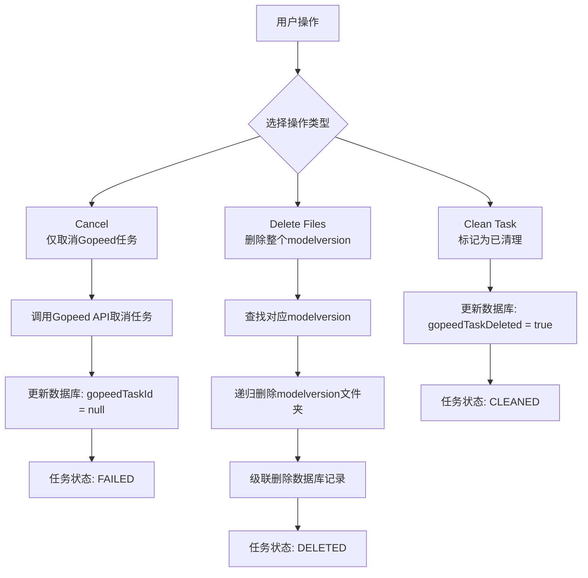
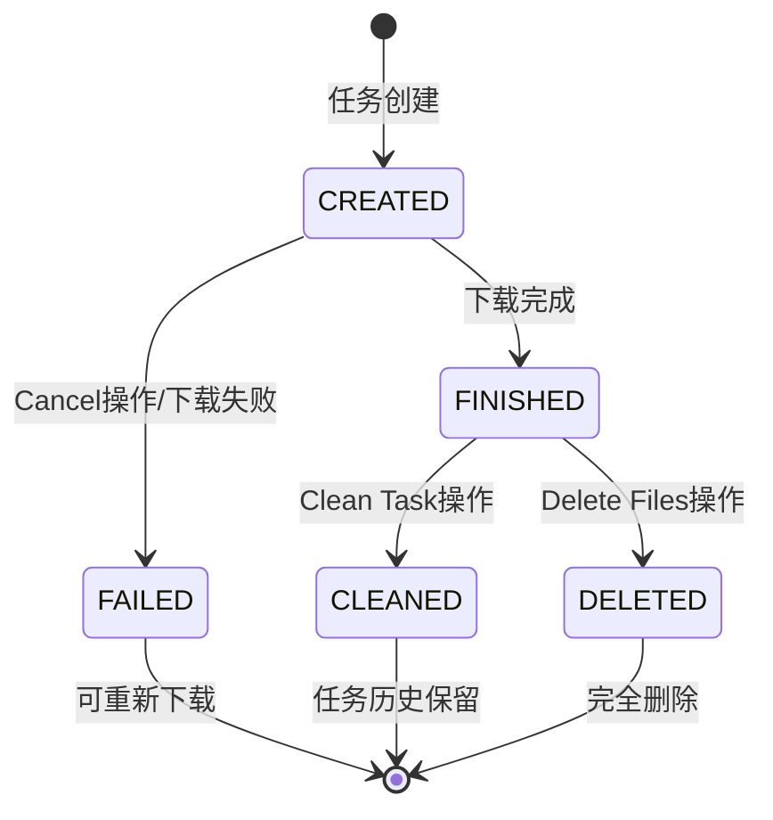

# DownloadManager 按钮功能重构方案

## 概述

本文档记录DownloadManager组件中Delete和Clean按钮的功能重构计划。基于对当前实现的分析和用户需求，我们制定了方案A来清晰区分不同操作的功能边界。

## 当前问题分析

### 1. 功能混淆
- **Delete按钮**：当前可以删除Gopeed任务，force=true时还会删除对应文件
- **Clean按钮**：标记任务为已清理，force=true时也会删除文件
- **操作粒度**：针对单个文件/图片，而非以modelversion为最小单位

### 2. 用户期望
1. **清晰的功能区分**：哪个操作删除文件？哪个仅删除Gopeed任务？
2. **合理的操作粒度**：删除文件时应以modelversion为最小单位
3. **完整的数据清理**：删除modelversion时应同时删除文件夹和数据库记录

## 方案A：重命名当前功能，添加新功能

### 按钮功能调整

| 当前按钮 | 新按钮名称 | 功能描述 | 操作粒度 | 文件系统影响 | 数据库影响 |
|----------|------------|----------|----------|--------------|------------|
| **Delete** | **Cancel** | 仅取消Gopeed下载任务 | 单个文件/图片 | 不删除文件 | 设置`gopeedTaskId = null` |
| **Clean** | **Delete Files** | 删除整个modelversion | 整个modelversion | 删除modelversion文件夹 | 删除所有相关记录 |
| - | **Clean Task** (可选) | 仅标记任务为已清理 | 单个文件/图片 | 不删除文件 | 设置`gopeedTaskDeleted = true` |

### 功能对比表格



### 状态转换流程图



## 技术实现要点

### 1. 后端API修改

#### 新增API端点
```typescript
// POST /gopeed/tasks/:taskId/cancel - 仅取消Gopeed任务
app.post("/tasks/:taskId/cancel", async ({ params }) => {
  // 调用Gopeed API取消任务
  // 更新数据库: gopeedTaskId = null
  // 返回成功响应
});

// DELETE /model-versions/:modelVersionId - 删除整个modelversion
app.delete("/model-versions/:modelVersionId", async ({ params }) => {
  // 1. 查找modelversion所有相关文件
  // 2. 递归删除文件夹
  // 3. 级联删除数据库记录
  // 4. 返回成功响应
});
```

#### 修改现有API
```typescript
// 修改DELETE /gopeed/tasks/:taskId - 默认force=false
app.delete("/tasks/:taskId", async ({ params, query }) => {
  const force = query.force === "true"; // 默认false
  // 仅删除Gopeed任务，不删除文件
});

// 修改POST /gopeed/tasks/:taskId/finish-and-clean - 移除force参数
app.post("/tasks/:taskId/finish-and-clean", async ({ params, body }) => {
  // 仅标记为已清理，不删除文件
});
```

### 2. 前端UI修改

#### 按钮显示条件
```typescript
// Actions列渲染逻辑
const renderActions = (record: DownloadTask) => {
  const canControl = record.gopeedTaskId && !record.gopeedTaskFinished;
  const isMedia = record.resourceType === "image";

  return (
    <Space size="small">
      {/* Cancel按钮 - 仅当有活动任务时显示 */}
      {canControl && (
        <Button
          size="small"
          danger
          icon={<CloseCircleOutlined />}
          onClick={() => handleCancelTask(record.gopeedTaskId!)}
        >
          Cancel
        </Button>
      )}
      
      {/* Delete Files按钮 - 当任务完成且未删除时显示 */}
      {record.gopeedTaskFinished && !record.gopeedTaskDeleted && (
        <Button
          size="small"
          danger
          type="primary"
          icon={<DeleteOutlined />}
          onClick={() => handleDeleteFiles(record.id, isMedia)}
        >
          Delete Files
        </Button>
      )}
      
      {/* Clean Task按钮 - 可选功能 */}
      {record.gopeedTaskFinished && !record.gopeedTaskDeleted && (
        <Button
          size="small"
          icon={<CheckCircleOutlined />}
          onClick={() => handleCleanTask(record.gopeedTaskId!, record.id, isMedia)}
        >
          Clean Task
        </Button>
      )}
    </Space>
  );
};
```

#### 确认对话框
```typescript
// Delete Files操作的确认对话框
const handleDeleteFiles = async (fileId: number, isMedia: boolean) => {
  Modal.confirm({
    title: '确认删除整个ModelVersion',
    content: '此操作将删除整个modelversion的文件夹和所有相关记录，且不可恢复。确定要继续吗？',
    okText: '删除',
    okType: 'danger',
    cancelText: '取消',
    onOk: async () => {
      try {
        await deleteModelVersion(fileId, isMedia);
        notification.success({ message: 'ModelVersion已删除' });
        fetchTasks();
      } catch (error) {
        notification.error({
          message: '删除失败',
          description: error instanceof Error ? error.message : '未知错误',
        });
      }
    },
  });
};
```

### 3. 数据库操作流程

#### 删除整个modelversion
```typescript
async function deleteModelVersion(modelVersionId: number) {
  // 1. 查找modelversion所有相关记录
  const modelVersion = await prisma.modelVersion.findUnique({
    where: { id: modelVersionId },
    include: {
      files: true,
      images: true,
      model: true,
    },
  });
  
  if (!modelVersion) {
    throw new Error('ModelVersion not found');
  }
  
  // 2. 获取文件夹路径
  const folderPath = getModelVersionFolderPath(
    settings.basePath,
    modelVersion.model.type,
    modelVersion.modelId,
    modelVersionId
  );
  
  // 3. 递归删除文件夹
  await fs.rm(folderPath, { recursive: true, force: true });
  
  // 4. 级联删除数据库记录
  await prisma.$transaction([
    // 先删除files和images
    prisma.modelVersionFile.deleteMany({
      where: { modelVersionId },
    }),
    prisma.modelVersionImage.deleteMany({
      where: { modelVersionId },
    }),
    // 再删除modelversion
    prisma.modelVersion.delete({
      where: { id: modelVersionId },
    }),
  ]);
}
```

## 实施步骤

### 阶段1：后端API修改
1. 新增`cancelTask`函数（仅取消Gopeed任务）
2. 新增`deleteModelVersion`函数（删除整个modelversion）
3. 修改现有API端点，移除force参数或设置默认值
4. 更新相关错误处理

### 阶段2：前端UI更新
1. 修改按钮文本和图标
2. 添加确认对话框
3. 更新API调用逻辑
4. 调整按钮显示条件

### 阶段3：测试验证
1. 单元测试：验证每个函数的功能
2. 集成测试：验证API端点的正确性
3. 端到端测试：验证完整用户流程

### 阶段4：文档更新
1. 更新API文档
2. 更新用户指南
3. 更新开发文档

## 风险与缓解措施

### 风险1：数据丢失
- **风险**：Delete Files操作可能误删重要数据
- **缓解**：添加强制确认对话框，明确提示操作后果

### 风险2：操作粒度混淆
- **风险**：用户可能不理解modelversion粒度的含义
- **缓解**：在UI中明确显示操作影响的范围

### 风险3：向后兼容性
- **风险**：修改API可能影响现有客户端
- **缓解**：保持现有API端点，添加新端点，逐步迁移

## 总结

方案A通过重命名按钮和调整功能边界，清晰区分了不同操作的目的和影响范围。关键改进包括：

1. **功能清晰化**：Cancel仅取消任务，Delete Files删除整个modelversion
2. **操作粒度合理化**：文件删除以modelversion为最小单位
3. **数据完整性**：删除操作同时清理文件系统和数据库
4. **用户安全**：危险操作添加确认对话框

此方案既满足了用户需求，又保持了系统的可维护性和安全性。