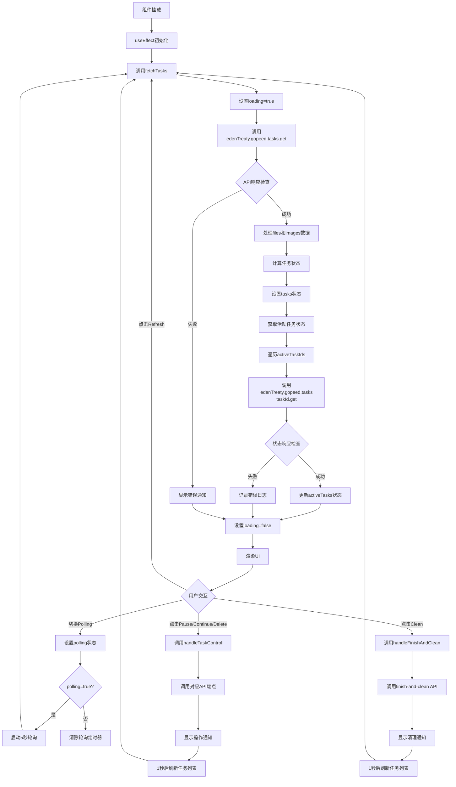

# DownloadManager 组件执行流程

## 概述

`DownloadManager` 组件是一个用于管理 Gopeed 下载任务的 React 组件。它提供了下载任务的列表展示、状态监控、任务控制（暂停/继续/删除）以及实时轮询更新功能。

## 架构设计

### 核心状态
```typescript
const [tasks, setTasks] = useState<DownloadTask[]>([]);          // 所有下载任务
const [loading, setLoading] = useState(false);                   // 加载状态
const [polling, setPolling] = useState(false);                   // 轮询开关
const [activeTasks, setActiveTasks] = useState<                  // 活动任务状态
  Record<string, GopeedTaskStatus>
>({});
```

### 主要接口
```typescript
interface DownloadTask {
  id: number;
  name?: string;
  url?: string;
  fileType?: string;
  imageType?: string;
  sizeKB?: number;
  gopeedTaskId: string | null;
  gopeedTaskFinished: boolean;
  gopeedTaskDeleted: boolean;
  status: keyof typeof TaskStatusConfig;
  resourceType: "file" | "image";
  modelVersion?: {
    id: number;
    name: string;
    model: {
      id: number;
      name: string;
    };
  };
}

interface GopeedTaskStatus {
  id: string;
  status: string;
  progress: number;
  speed: number;
  error?: string | null;
  createAt: string;
}
```

## 执行流程图



## 详细执行顺序

### 阶段1：组件初始化
1. **状态初始化** - 组件挂载时初始化所有状态变量
2. **useEffect调用** - 依赖`fetchTasks`的useEffect执行
3. **首次数据加载** - 调用`fetchTasks()`获取初始数据

### 阶段2：数据获取流程 (fetchTasks)
```typescript
const fetchTasks = useCallback(async () => {
  setLoading(true);
  try {
    // 1. 调用后端API获取任务列表
    const { data, error } = await edenTreaty.gopeed.tasks.get();
    
    // 2. 验证响应格式
    if (!data || typeof data !== "object" || !("files" in data) || !("images" in data)) {
      throw new Error("Invalid response format");
    }
    
    // 3. 处理文件和图像数据
    const processTasks = (items: any[], resourceType: "file" | "image") => {
      return items.map((item) => ({
        ...item,
        resourceType,
        status: calculateTaskStatus(
          item.gopeedTaskId,
          item.gopeedTaskFinished,
          item.gopeedTaskDeleted,
        ),
      }));
    };
    
    const files = processTasks(responseData.files || [], "file");
    const images = processTasks(responseData.images || [], "image");
    const allTasks = [...files, ...images];
    
    // 4. 更新主任务列表
    setTasks(allTasks);
    
    // 5. 获取活动任务的详细状态
    const activeTaskIds = allTasks
      .filter((task) => task.gopeedTaskId && !task.gopeedTaskFinished)
      .map((task) => task.gopeedTaskId as string);
    
    const taskStatuses: Record<string, GopeedTaskStatus> = {};
    for (const taskId of activeTaskIds) {
      try {
        const { data: statusData, error: statusError } =
          await edenTreaty.gopeed.tasks({ taskId }).get();
        
        // 6. 验证并处理状态响应
        if (statusData && typeof statusData === "object") {
          if ("code" in maybeResponse) {
            // 错误响应，跳过
            continue;
          }
          
          if ("id" in maybeResponse && "status" in maybeResponse && 
              "progress" in maybeResponse && "speed" in maybeResponse && 
              "createAt" in maybeResponse) {
            taskStatuses[taskId] = {
              id: String(maybeResponse.id),
              status: String(maybeResponse.status),
              progress: Number(maybeResponse.progress) || 0,
              speed: Number(maybeResponse.speed) || 0,
              createAt: String(maybeResponse.createAt),
            };
          }
        }
      } catch (error) {
        console.error(`Failed to get status for task ${taskId}:`, error);
      }
    }
    
    // 7. 更新活动任务状态
    setActiveTasks(taskStatuses);
    
  } catch (error) {
    // 8. 错误处理
    console.error("Failed to fetch tasks:", error);
    notification.error({
      message: "Failed to fetch tasks",
      description: error instanceof Error ? error.message : "Unknown error",
    });
  } finally {
    // 9. 清理加载状态
    setLoading(false);
  }
}, []);
```

### 阶段3：轮询机制
```typescript
// Setup polling (every 5 seconds)
useEffect(() => {
  let interval: NodeJS.Timeout;
  if (polling) {
    interval = setInterval(() => {
      fetchTasks();
    }, 5000);
  }
  return () => {
    if (interval) clearInterval(interval);
  };
}, [polling, fetchTasks]);
```

### 阶段4：任务控制操作
```typescript
const handleTaskControl = async (
  action: "pause" | "continue" | "delete",
  taskId: string,
  force?: boolean,
) => {
  try {
    const tasksApi = edenTreaty.gopeed.tasks as any;
    switch (action) {
      case "pause":
        await tasksApi[taskId].pause.post();
        notification.success({ message: "Task paused" });
        break;
      case "continue":
        await tasksApi[taskId].continue.post();
        notification.success({ message: "Task continued" });
        break;
      case "delete": {
        const query = force ? { force: "true" } : {};
        await tasksApi[taskId].delete(query);
        notification.success({ message: "Task deleted" });
        break;
      }
    }
    // 操作完成后刷新任务列表
    setTimeout(() => fetchTasks(), 1000);
  } catch (error) {
    notification.error({
      message: "Operation failed",
      description: error instanceof Error ? error.message : "Unknown error",
    });
  }
};
```

### 阶段5：完成和清理任务
```typescript
const handleFinishAndClean = async (
  taskId: string,
  fileId: number,
  isMedia: boolean,
  force?: boolean,
) => {
  try {
    const tasksApi = edenTreaty.gopeed.tasks as any;
    await tasksApi[taskId]["finish-and-clean"].post({
      fileId,
      isMedia,
      force,
    });
    notification.success({ message: "Task completed and cleaned" });
    setTimeout(() => fetchTasks(), 1000);
  } catch (error) {
    notification.error({
      message: "Operation failed",
      description: error instanceof Error ? error.message : "Unknown error",
    });
  }
};
```

## 后端API调用流程

### 1. 获取任务列表
```
GET /gopeed/tasks
```
- 返回：`{ files: ModelVersionFile[], images: ModelVersionImage[] }`
- 后端实现：`src/modules/gopeed/index.ts`中的`/tasks`端点

### 2. 获取单个任务状态
```
GET /gopeed/tasks/:taskId
```
- 返回：`{ id, status, progress, speed, createAt }`
- 用于获取活动任务的实时进度

### 3. 任务控制API
```
POST /gopeed/tasks/:taskId/pause      # 暂停任务
POST /gopeed/tasks/:taskId/continue   # 继续任务
DELETE /gopeed/tasks/:taskId          # 删除任务
POST /gopeed/tasks/:taskId/finish-and-clean  # 完成并清理
```

## 状态计算逻辑

### 任务状态计算
```typescript
const calculateTaskStatus = (
  gopeedTaskId: string | null,
  gopeedTaskFinished: boolean,
  gopeedTaskDeleted: boolean,
): keyof typeof TaskStatusConfig => {
  if (gopeedTaskDeleted) {
    return "CLEANED";
  }
  if (gopeedTaskFinished) {
    return "FINISHED";
  }
  if (gopeedTaskId) {
    return "CREATED";
  }
  return "FAILED";
};
```

### 状态映射
```typescript
const TaskStatusConfig = {
  FAILED: { color: "red", text: "Failed", icon: <CloseCircleOutlined /> },
  CREATED: { color: "blue", text: "In Progress", icon: <CloudDownloadOutlined /> },
  FINISHED: { color: "green", text: "Completed", icon: <CheckCircleOutlined /> },
  CLEANED: { color: "default", text: "Cleaned", icon: <CheckCircleOutlined /> },
};
```

## 错误处理机制

### 1. API错误处理
- 使用`edenTreaty`的错误响应结构
- 显示Ant Design通知提示用户
- 记录详细错误日志到控制台

### 2. 数据验证
- 验证API响应格式
- 过滤无效的关联数据（modelVersion/model）
- 处理缺失或异常的数据字段

### 3. 网络错误
- 超时和重试机制
- 用户友好的错误消息
- 操作失败后的状态回滚

## 性能优化

### 1. 使用useCallback
```typescript
const fetchTasks = useCallback(async () => {
  // 函数体
}, []);
```
避免不必要的函数重新创建，优化依赖项数组。

### 2. 条件性轮询
```typescript
useEffect(() => {
  let interval: NodeJS.Timeout;
  if (polling) {
    interval = setInterval(() => {
      fetchTasks();
    }, 5000);
  }
  return () => {
    if (interval) clearInterval(interval);
  };
}, [polling, fetchTasks]);
```
只在`polling`为true时启动轮询，避免不必要的网络请求。

### 3. 批量状态更新
- 合并相关状态更新
- 使用函数式更新确保状态一致性
- 避免在渲染过程中进行昂贵的计算

## 用户交互流程

### 1. 页面加载
1. 显示加载状态
2. 获取初始任务列表
3. 渲染统计卡片和任务表格

### 2. 任务监控
1. 启用轮询自动刷新
2. 实时更新进度条和速度
3. 状态变化时自动更新UI

### 3. 任务控制
1. 用户点击操作按钮
2. 调用对应API端点
3. 显示操作结果通知
4. 自动刷新任务列表

### 4. 数据筛选
1. 使用Tabs切换不同状态的任务
2. 实时过滤和显示对应状态的任务
3. 保持表格排序和分页状态

## 总结

`DownloadManager`组件通过清晰的执行流程和状态管理，提供了完整的Gopeed下载任务管理功能。其核心特点包括：

1. **模块化设计** - 分离的数据获取、状态计算和UI渲染
2. **实时更新** - 支持轮询和手动刷新两种更新方式
3. **完整控制** - 提供暂停、继续、删除、清理等完整操作
4. **错误恢复** - 完善的错误处理和用户反馈机制
5. **性能优化** - 使用React最佳实践优化渲染性能

该组件与后端`/gopeed`API紧密集成，形成了完整的前后端下载管理解决方案。