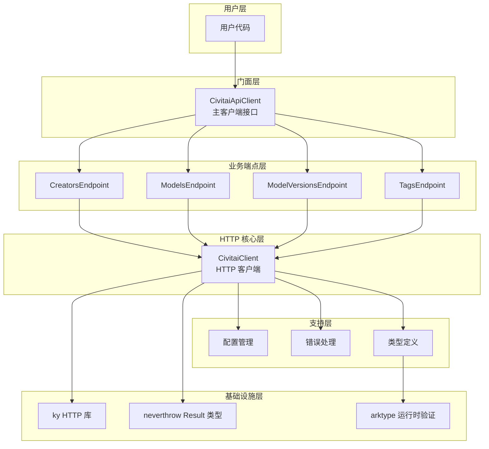

# Civitai API Client 架构设计文档

## 概述

本文档详细描述了 Civitai API Client 的架构设计、设计模式应用以及关键设计决策。该客户端采用分层架构和多种设计模式，旨在构建一个**类型安全、可维护、可扩展、可测试**的 API 客户端库。

## 架构总览

### 分层架构图



### 目录结构

```
packages/civitai-api/src/v1/
├── client/                    # 客户端核心实现
│   ├── index.ts              # 主入口和工厂函数
│   ├── client.ts             # HTTP 客户端核心
│   ├── config.ts             # 配置管理
│   ├── errors.ts             # 错误类型定义
│   └── endpoints/            # API 端点实现
│       ├── creators.ts       # 创作者端点
│       ├── models.ts         # 模型端点
│       ├── model-versions.ts # 模型版本端点
│       └── tags.ts           # 标签端点
└── models/                   # 数据模型定义
    ├── creators.ts
    ├── models.ts
    ├── model-id.ts
    ├── model-version.ts
    └── shared-types.ts
```

## 设计模式与架构思想对应表

### 1. 工厂模式 (Factory Pattern)

| 组件 | 位置 | 设计思想 | 代码示例 |
|------|------|----------|----------|
| `createCivitaiClient` | `index.ts` | **隐藏实现细节**，提供统一的创建接口 | `export function createCivitaiClient(config) { return new CivitaiApiClientImpl(config); }` |
| 默认导出 | `index.ts` | **简化导入**，用户只需知道工厂函数 | `export default createCivitaiClient;` |

**设计目的**：
- 封装复杂的对象创建过程
- 提供一致的创建接口
- 未来可以返回不同的实现类而不影响调用方

### 2. 门面模式 (Facade Pattern)

| 组件 | 位置 | 设计思想 | 代码示例 |
|------|------|----------|----------|
| `CivitaiApiClient` | `index.ts` | **简化复杂系统**，提供统一的高级接口 | `interface CivitaiApiClient { readonly creators; readonly models; ... }` |
| `CivitaiClient` | `client.ts` | **封装 HTTP 复杂性**，提供简洁的请求方法 | `class CivitaiClient { get(); post(); put(); delete(); }` |

**设计目的**：
- 隐藏底层 HTTP 请求的复杂性
- 提供简单易用的高级 API
- 降低客户端代码与底层实现的耦合度

### 3. 依赖注入 (Dependency Injection)

| 组件 | 位置 | 设计思想 | 代码示例 |
|------|------|----------|----------|
| 端点构造函数 | `endpoints/*.ts` | **松耦合**，通过构造函数注入依赖 | `constructor(private readonly client: CivitaiClient) {}` |
| 主客户端初始化 | `index.ts` | **组合对象**，创建并注入依赖 | `this.creators = new CreatorsEndpointImpl(this.client);` |

**设计目的**：
- 提高可测试性（可以注入 mock 对象）
- 遵循依赖倒置原则（DIP）
- 实现组件间的松耦合

### 4. 接口与实现分离 (Interface Segregation)

| 组件 | 位置 | 设计思想 | 代码示例 |
|------|------|----------|----------|
| 端点接口 | `endpoints/*.ts` | **定义契约**，明确 API 边界 | `export interface ModelsEndpoint { list(); getById(); }` |
| 主客户端接口 | `index.ts` | **抽象客户端行为**，隐藏实现细节 | `export interface CivitaiApiClient { readonly client; readonly creators; ... }` |

**设计目的**：
- 明确组件职责
- 支持多态和替换
- 提高代码的可读性和可维护性

### 5. 策略模式 (Strategy Pattern)

| 组件 | 位置 | 设计思想 | 代码示例 |
|------|------|----------|----------|
| 错误处理 | `client.ts` | **根据错误类型选择处理策略** | `if (status === 400) { return createBadRequestError(...); }` |
| 参数处理 | `endpoints/models.ts` | **根据参数类型选择处理方式** | `if (Array.isArray(value)) { result[key] = value.join(','); }` |

**设计目的**：
- 封装可互换的算法
- 避免复杂的条件判断
- 提高代码的可扩展性

### 6. 建造者模式 (Builder Pattern)

| 组件 | 位置 | 设计思想 | 代码示例 |
|------|------|----------|----------|
| 配置合并 | `config.ts` | **逐步构建复杂对象** | `return { ...DEFAULT_CONFIG, ...userConfig };` |
| 请求选项 | `client.ts` | **灵活构建请求参数** | `const kyOptions: KyOptions = {}; if (options?.searchParams) { ... }` |

**设计目的**：
- 简化复杂对象的创建过程
- 提供灵活的配置选项
- 支持链式调用和逐步构建

### 7. 模板方法模式 (Template Method Pattern)

| 组件 | 位置 | 设计思想 | 代码示例 |
|------|------|----------|----------|
| 请求处理流程 | `client.ts` | **定义算法骨架**，子步骤可定制 | `private async request<T>(method, path, options) { 1.准备参数; 2.执行请求; 3.处理响应; 4.验证; 5.错误处理; }` |

**设计目的**：
- 定义算法的整体结构
- 允许子类重写特定步骤
- 避免代码重复

### 8. 组合模式 (Composite Pattern)

| 组件 | 位置 | 设计思想 | 代码示例 |
|------|------|----------|----------|
| 主客户端组合 | `index.ts` | **整体-部分关系**，组合多个端点 | `this.creators = ...; this.models = ...; this.modelVersions = ...;` |

**设计目的**：
- 统一对待单个对象和组合对象
- 构建树形结构
- 简化客户端的使用

## 关键设计决策详解

### 1. 类型安全优先

**决策**：使用 arktype 进行运行时类型验证

**原因**：
- 提供编译时和运行时的双重类型安全
- 自动生成 TypeScript 类型定义
- 减少运行时错误

**实现**：
```typescript
// 定义 schema，自动推断类型
export const modelSchema = type({
  id: "number.integer",
  name: "string",
  description: "string | null",
  type: modelTypesSchema,
  // ...
});
export type Model = typeof modelSchema.infer; // 自动推断类型
```

### 2. 错误处理策略

**决策**：使用 neverthrow 的 Result<T, E> 模式

**原因**：
- 强制错误处理，避免未捕获的异常
- 类型安全的错误信息
- 函数式编程风格，提高代码可预测性

**实现**：
```typescript
// 所有 API 方法返回 Result 类型
async get<T>(path: string): Promise<Result<T, CivitaiError>> {
  try {
    // ... 成功时返回 ok(data)
    return ok(data as T);
  } catch (error) {
    // ... 失败时返回 err(error)
    return err(this.handleRequestError(error));
  }
}

// 使用方式
const result = await client.models.list();
if (result.isOk()) {
  const models = result.value;
} else {
  const error = result.error;
}
```

### 3. 增强的错误类型系统

**决策**：扩展错误类型以覆盖常见 HTTP 状态码

**原因**：
- 提供更精确的错误分类
- 便于开发者针对特定错误类型进行处理
- 改善调试和错误报告体验

**新增错误类型**：
- `UnauthorizedError` (401)：未添加 HTTP Auth Header 导致的认证错误
- `NotFoundError` (404)：没有找到相对应的资源错误

**实现**：
```typescript
// 错误类型定义
export type UnauthorizedError = {
  type: 'UNAUTHORIZED';
  status: 401;
  message: string;
  details?: { suggestion?: string };
};

export type NotFoundError = {
  type: 'NOT_FOUND';
  status: 404;
  message: string;
  details?: any;
};

// 错误处理逻辑
private handleRequestError(error: unknown): CivitaiError {
  if (error instanceof Error && 'response' in error) {
    const response = (error as any).response as Response | undefined;
    
    if (response) {
      const status = response.status;
      
      if (status === 401) {
        return createUnauthorizedError(
          `Unauthorized: ${response.statusText}. Please provide a valid API key.`,
          { suggestion: 'Add your API key to the client configuration' }
        );
      }
      
      if (status === 404) {
        return createNotFoundError(
          `Not Found: ${response.statusText}. The requested resource does not exist.`,
          { status, statusText: response.statusText }
        );
      }
    }
  }
  // ... 其他错误处理
}
```

### 3. 配置管理设计

**决策**：集中式配置管理，支持运行时更新

**原因**：
- 统一管理所有配置选项
- 避免配置分散在各个端点
- 支持动态配置更新

**实现**：
```typescript
// 默认配置
export const DEFAULT_CONFIG = {
  baseUrl: 'https://civitai.com/api/v1',
  timeout: 30000,
  validateResponses: false,
};

// 合并配置
export function mergeConfig(userConfig: ClientConfig = {}) {
  return { ...DEFAULT_CONFIG, ...userConfig };
}

// 运行时更新
updateConfig(newConfig: Partial<ClientConfig>): void {
  Object.assign(this.config, newConfig);
  this.kyInstance = this.createKyInstance(); // 重新创建 HTTP 实例
}
```

### 4. Arktype 响应验证系统

**决策**：实现基于路径的响应数据验证

**原因**：
- 确保 API 响应符合预期的数据结构
- 利用 arktype 提供详细的验证错误信息
- 在开发阶段早期发现 API 契约违反问题

**实现**：
```typescript
// 路径到 schema 的映射
private getSchemaForPath(path: string): any | null {
  const pathSchemaMap: Record<string, any> = {
    '/models': modelsResponseSchema,
    '/models/': modelsResponseSchema,
    '/creators': creatorsResponseSchema,
    '/creators/': creatorsResponseSchema,
    '/model-versions/': modelVersionSchema,
  };
  
  // 检查精确匹配
  if (pathSchemaMap[path]) {
    return pathSchemaMap[path];
  }
  
  // 检查模式匹配
  for (const [pattern, schema] of Object.entries(pathSchemaMap)) {
    if (pattern.endsWith('/') && path.startsWith(pattern)) {
      return schema;
    }
  }
  
  return null;
}

// 响应验证逻辑
private async validateResponse<T>(path: string, data: unknown): Promise<Result<T, ValidationError>> {
  try {
    const schema = this.getSchemaForPath(path);
    
    if (!schema) {
      // 没有对应的 schema，跳过验证
      return ok(data as T);
    }

    // 使用 arktype 进行验证
    const validationResult = schema(data);

    // 检查验证是否失败
    if (validationResult instanceof type.errors) {
      // 创建包含 arktype 详细错误信息的验证错误
      return err(createValidationError(
        `Response validation failed for path: ${path}`,
        validationResult
      ));
    }

    // 验证成功，返回验证后的数据
    return ok(validationResult as T);
  } catch (error) {
    // 处理验证过程中的异常
    return err(createValidationError(
      `Unexpected error during validation for path ${path}`,
      error
    ));
  }
}
```

**优势**：
1. **详细的错误信息**：arktype 提供人类可读的错误消息，如：
   - `"Expected number at 'items[0].id', got string ('not-a-number')"`
   - `"Expected string at 'items[0].name', got number (123)"`
   - `"Expected one of ['Checkpoint', 'LORA', ...] at 'items[0].type', got 'InvalidType'"`
   
2. **可配置的验证**：通过 `validateResponses` 配置选项控制是否启用验证
3. **路径感知**：根据 API 路径自动选择正确的 schema 进行验证
4. **类型安全**：验证成功的数据具有正确的 TypeScript 类型

### 5. HTTP 请求抽象

**决策**：在 CivitaiClient 中封装 HTTP 方法

**原因**：
- 统一处理认证、超时、代理等
- 提供一致的错误处理
- 简化端点实现

**实现**：
```typescript
class CivitaiClient {
  // 提供类型安全的 HTTP 方法
  async get<T>(path: string, options?): Promise<Result<T, CivitaiError>> {
    return this.request<T>('GET', path, options);
  }
  
  async post<T>(path: string, options?): Promise<Result<T, CivitaiError>> {
    return this.request<T>('POST', path, options);
  }
  
  // 统一的请求处理
  private async request<T>(method, path, options?) {
    // 统一处理：参数清理、认证、请求、响应处理、错误处理
  }
}
```

## SOLID 原则应用

### 1. 单一职责原则 (Single Responsibility Principle)

- `CivitaiClient`：只负责 HTTP 请求处理
- `Config`：只负责配置管理
- `Errors`：只负责错误类型定义
- 每个端点：只负责特定 API 的业务逻辑

### 2. 开闭原则 (Open/Closed Principle)

- 接口设计允许扩展新端点而不修改现有代码
- 配置系统允许添加新配置选项而不破坏现有功能
- 错误处理系统可以添加新错误类型而不影响现有错误处理

### 3. 里氏替换原则 (Liskov Substitution Principle)

- 所有端点实现都可以替换其接口
- 不同的 CivitaiClient 实现可以互换使用
- 错误类型可以安全地向上转型为 CivitaiError

### 4. 接口隔离原则 (Interface Segregation Principle)

- 每个端点都有小而专的接口
- 客户端接口只暴露必要的方法
- 配置接口只包含相关的配置选项

### 5. 依赖倒置原则 (Dependency Inversion Principle)

- 高层模块（端点）不依赖低层模块（HTTP 客户端），都依赖抽象
- 抽象（接口）不依赖细节，细节依赖抽象
- 通过依赖注入实现松耦合

## 扩展指南

### 添加新端点的步骤

1. **创建端点接口**（在 `endpoints/` 目录）：
   ```typescript
   export interface NewEndpoint {
     method1(options?: Options): Promise<Result<Response, CivitaiError>>;
     method2(id: number): Promise<Result<Item, CivitaiError>>;
   }
   ```

2. **创建端点实现**：
   ```typescript
   export class NewEndpointImpl implements NewEndpoint {
     constructor(private readonly client: CivitaiClient) {}
     
     async method1(options?: Options) {
       return this.client.get<Response>('/new-endpoint', {
         searchParams: options,
       });
     }
   }
   ```

3. **在主客户端中注册**（修改 `index.ts`）：
   ```typescript
   export interface CivitaiApiClient {
     readonly newEndpoint: NewEndpoint;
     // ... 其他端点
   }
   
   export class CivitaiApiClientImpl implements CivitaiApiClient {
     readonly newEndpoint: NewEndpoint;
     
     constructor(config: ClientConfig = {}) {
       this.client = new CivitaiClient(config);
       this.newEndpoint = new NewEndpointImpl(this.client);
       // ... 其他端点初始化
     }
   }
   ```

4. **添加类型定义**（在 `models/` 目录）：
   ```typescript
   // 定义请求/响应类型
   export interface NewResponse {
     items: NewItem[];
     metadata: PaginationMetadata;
   }
   ```

## 最佳实践

### 1. 错误处理最佳实践

```typescript
// ✅ 推荐：使用 Result 类型进行错误处理
const result = await client.models.list();
if (result.isOk()) {
  // 处理成功
  const data = result.value;
} else {
  // 处理错误
  const error = result.error;
  switch (error.type) {
    case 'NETWORK_ERROR':
      // 处理网络错误
      break;
    case 'VALIDATION_ERROR':
      // 处理验证错误
      break;
  }
}

// ❌ 不推荐：使用 try-catch（会丢失类型信息）
try {
  const data = await client.models.list();
} catch (error) {
  // error 类型不明确
}
```

### 2. 配置最佳实践

```typescript
// ✅ 推荐：使用类型安全的配置
const client = createCivitaiClient({
  apiKey: process.env.CIVITAI_API_KEY,
  timeout: 60000,
  validateResponses: true,
});

// ✅ 推荐：运行时更新配置
client.updateConfig({
  timeout: 120000,
  headers: { 'X-Custom-Header': 'value' },
});
```

### 3. 类型安全最佳实践

```typescript
// ✅ 推荐：使用自动推断的类型
import type { Model, ModelsResponse } from './src/v1/models/models.js';

// 类型安全的使用
const result = await client.models.getById(123);
if (result.isOk()) {
  const model: Model = result.value; // 类型正确
  console.log(model.name); // 类型安全访问
}
```

## 总结

Civitai API Client 的设计体现了现代 TypeScript 项目的最佳实践：

1. **分层架构**：清晰的职责分离
2. **设计模式应用**：多种模式解决特定问题
3. **类型安全**：编译时和运行时的双重保障
4. **错误处理**：强制性的、类型安全的错误处理
5. **可测试性**：依赖注入和接口分离便于测试
6. **可扩展性**：易于添加新功能和端点

这个设计不仅解决了当前的需求，还为未来的扩展和维护奠定了坚实的基础。通过理解这些设计决策，开发者可以更有效地使用、扩展和维护这个 API 客户端。
