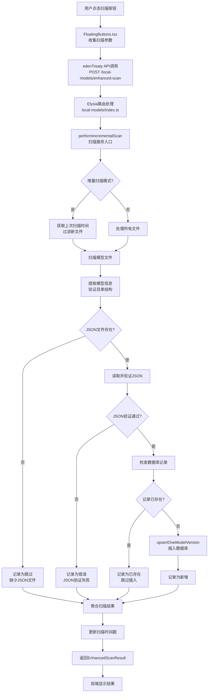
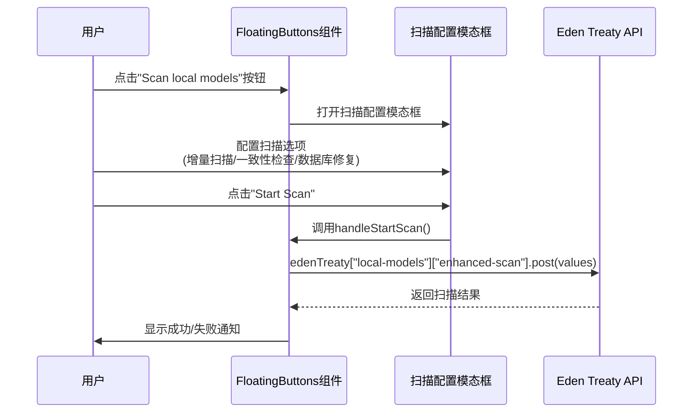
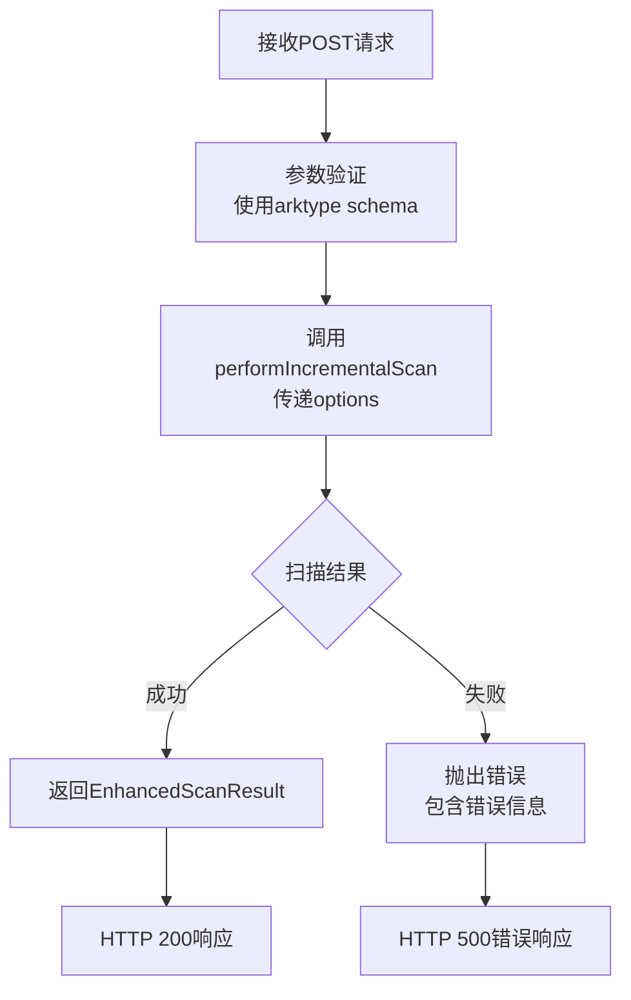
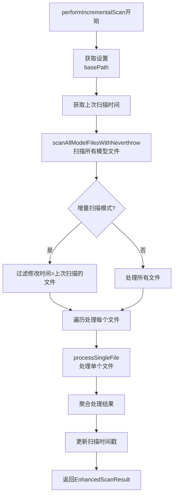
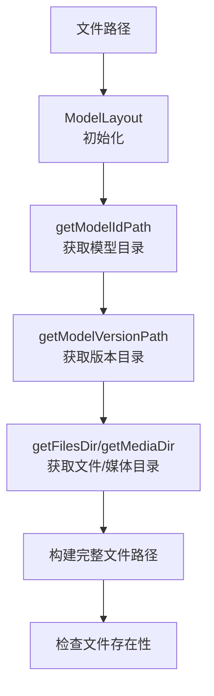
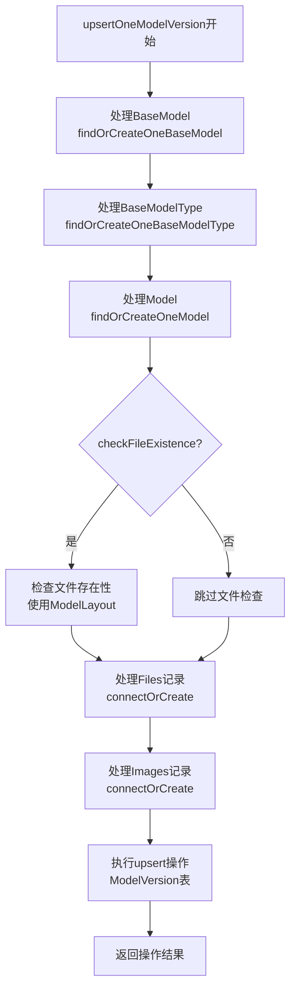
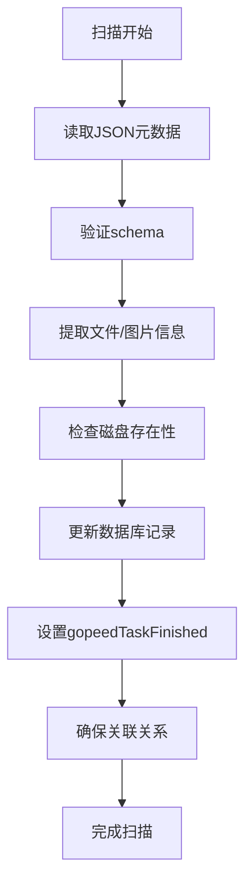
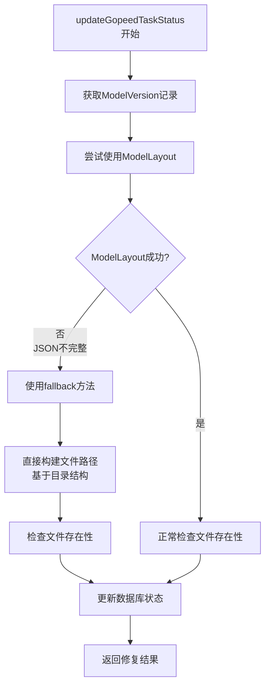
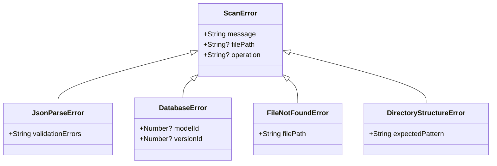
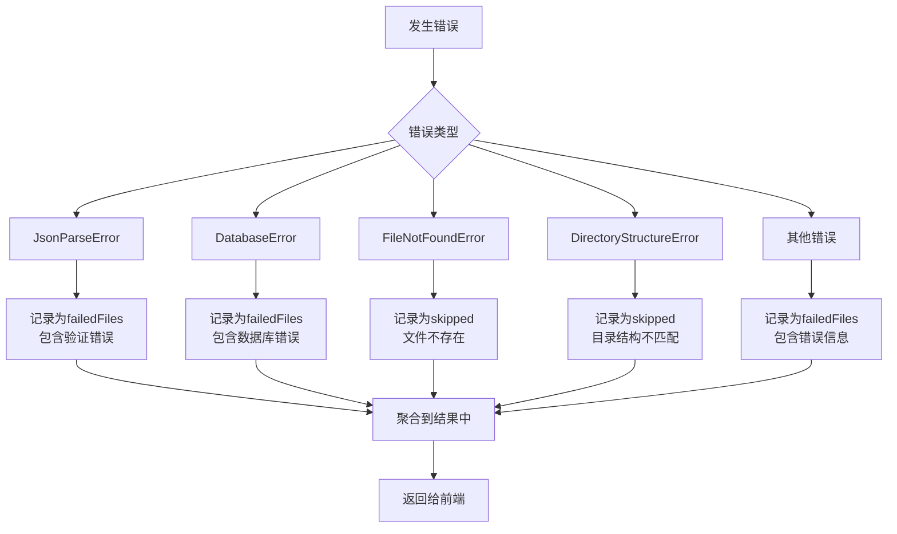

# Enhanced Scan 执行流程文档

## 概述

`enhanced-scan` 是本地模型扫描功能的核心组件，负责扫描本地存储的模型文件，验证JSON元数据，并将模型信息同步到数据库中。该功能支持增量扫描、一致性检查和数据库修复。

## 整体执行流程图



## 前端调用流程 (FloatingButtons.tsx)

### 1. 用户交互触发


### 2. 参数传递
```typescript
// 扫描配置参数
const values = {
  incremental: true,      // 增量扫描（仅新/修改的文件）
  checkConsistency: true, // 检查数据库一致性
  repairDatabase: false   // 修复不一致记录
};
```

## 后端API流程 (local-models/index.ts)

### 1. 路由定义
```typescript
// POST /local-models/enhanced-scan
.post(
  "/enhanced-scan",
  async ({ body }) => {
    const options = body || {};
    const result = await performIncrementalScan(options);
    if (result.isErr()) {
      throw new Error(`Enhanced scan failed: ${result.error.message}`);
    }
    return result.value;
  },
  {
    body: type({
      "incremental?": "boolean",
      "checkConsistency?": "boolean",
      "repairDatabase?": "boolean",
      "maxConcurrency?": "number",
    }),
    response: type({
      totalFilesScanned: "number",
      newRecordsAdded: "number",
      existingRecordsFound: "number",
      consistencyErrors: "string[]",
      repairedRecords: "number",
      failedFiles: "string[]",
      scanDurationMs: "number",
    }),
  }
)
```

### 2. 请求处理流程


## 扫描服务流程 (scan-models.ts)

### 1. 主函数：performIncrementalScan



### 2. 文件处理流程：processSingleFile

```mermaid
flowchart TD
    A[processSingleFile开始] --> B[extractModelInfo<br>提取模型信息]
    B --> C{目录结构有效?}
    C -->|否| D[返回"skipped"<br>目录结构不匹配]
    C -->|是| E[检查JSON文件存在性]
    E --> F{JSON文件都存在?}
    F -->|否| G[返回"skipped"<br>缺少JSON文件]
    F -->|是| H[读取并解析JSON]
    H --> I[验证JSON schema]
    I --> J{JSON验证通过?}
    J -->|否| K[返回"error"<br>JSON验证失败]
    J -->|是| L[检查数据库记录]
    L --> M{记录已存在?}
    M -->|是| N[返回"exists"<br>跳过插入]
    M -->|否| O[upsertOneModelVersion<br>插入数据库]
    O --> P{插入成功?}
    P -->|是| Q[返回"added"<br>新增记录]
    P -->|否| R[返回"error"<br>数据库错误]
```

### 3. 模型信息提取
```typescript
// 从文件路径提取模型信息
// 路径格式: {basePath}/{modelType}/{modelId}/{versionId}/files/{filename}
const modelInfo = extractModelInfo(filePath);
// 返回: { modelType, modelId, versionId }
```

## 文件布局流程 (file-layout.ts)

### 1. 目录结构
```
{baseDir}/
├── {modelType}/
│   ├── {modelId}/
│   │   ├── {modelId}.api-info.json          # 模型元数据
│   │   └── {versionId}/
│   │       ├── {versionId}.api-info.json    # 版本元数据
│   │       ├── files/
│   │       │   └── {filename}.safetensors   # 模型文件
│   │       └── media/
│   │           └── {imageId}.jpg            # 预览图片
```

### 2. 路径解析流程


## 数据库操作流程

### 1. 数据库插入/更新 (upsertOneModelVersion)


### 2. Files记录处理流程
```mermaid
sequenceDiagram
    participant Scan as 扫描服务
    participant DB as 数据库服务
    participant Prisma as Prisma ORM
    participant Files as ModelVersionFile表
    
    Scan->>DB: 处理modelVersion.files数组
    DB->>Prisma: 对每个文件执行connectOrCreate
    Prisma->>Files: findUnique(file.id)
    alt 文件记录不存在
        Files-->>Prisma: null
        Prisma->>Files: create({
            id: file.id,
            sizeKB: file.sizeKB,
            name: file.name,
            type: file.type,
            downloadUrl: file.downloadUrl,
            gopeedTaskId: null,
            gopeedTaskFinished: fileExists,  # 基于磁盘存在性
            gopeedTaskDeleted: false
        })
    else 文件记录存在
        Files-->>Prisma: 现有记录
        Prisma->>Files: update(连接关系)
    end
    Prisma-->>DB: 操作结果
    DB-->>Scan: 文件记录处理完成
```

### 3. Images记录处理流程
```mermaid
sequenceDiagram
    participant Scan as 扫描服务
    participant DB as 数据库服务
    participant Prisma as Prisma ORM
    participant Images as ModelVersionImage表
    
    Scan->>DB: 处理modelVersion.images数组
    DB->>Prisma: 对每个图片执行connectOrCreate
    Prisma->>Images: findUnique(imageId)
    alt 图片记录不存在
        Images-->>Prisma: null
        Prisma->>Images: create({
            id: imageId,  # 从URL提取
            url: image.url,
            nsfwLevel: image.nsfwLevel,
            width: image.width,
            height: image.height,
            hash: image.hash,
            type: image.type,
            gopeedTaskId: null,
            gopeedTaskFinished: fileExists,  # 基于磁盘存在性
            gopeedTaskDeleted: false
        })
    else 图片记录存在
        Images-->>Prisma: 现有记录
        Prisma->>Images: update(连接关系)
    end
    Prisma-->>DB: 操作结果
    DB-->>Scan: 图片记录处理完成
```

### 4. 文件存在性检查逻辑
```typescript
// 检查文件存在性
const checkFileExists = async (fileId: number, fileName: string): Promise<boolean> => {
  if (!checkFileExistence) return false;
  
  const modelLayout = new ModelLayout(basePath, modelWithVersion);
  const mvLayout = modelLayout.getModelVersionLayout(modelVersion.id);
  const filePath = mvLayout.getFilePath(fileId);
  return await Bun.file(filePath).exists();
};

// 检查图片存在性
const checkImageExists = async (imageUrl: string, imageId: number): Promise<boolean> => {
  if (!checkFileExistence) return false;
  
  const modelLayout = new ModelLayout(basePath, modelWithVersion);
  const mvLayout = modelLayout.getModelVersionLayout(modelVersion.id);
  const imagePath = mvLayout.getMediaPath(imageId);
  return await Bun.file(imagePath).exists();
};
```

### 5. 关联数据处理
- **BaseModel**: 基础模型类型（SDXL, SD1.5等）
- **BaseModelType**: 基础模型分类
- **Creator**: 创作者信息
- **ModelType**: 模型类型（Checkpoint, LORA等）
- **Tags**: 标签关联
- **Files**: 模型文件信息（包含gopeed任务状态）
- **Images**: 预览图片信息（包含gopeed任务状态）

### 6. Gopeed任务状态管理
扫描过程中会根据文件在磁盘上的存在性自动设置`gopeedTaskFinished`字段：
- 如果文件存在于磁盘：`gopeedTaskFinished = true`
- 如果文件不存在于磁盘：`gopeedTaskFinished = false`
- `gopeedTaskId`: 初始为null，下载时更新
- `gopeedTaskDeleted`: 初始为false，删除时更新

### 7. 数据一致性保证


### 8. Gopeed任务状态修复机制
当JSON文件不完整导致`ModelLayout`失败时，系统提供fallback修复机制：



#### Fallback方法特点：
1. **直接路径构建** - 不依赖ModelLayout，直接使用`getFilesDir`/`getMediaDir`
2. **文件存在性检查** - 直接检查磁盘文件
3. **图片ID提取** - 从URL提取图片ID，尝试多种扩展名
4. **错误恢复** - 单个文件失败不影响其他文件处理
5. **孤儿任务标记** - 当`gopeedTaskId === null`时，自动设置`gopeedTaskDeleted = true`

#### 修复API：
- `POST /local-models/fix-gopeed-task-status` - 修复所有模型版本的gopeed任务状态
- 支持JSON不完整的情况
- 自动检测并修复状态不一致的记录
- 自动标记孤儿任务为已删除

#### 孤儿任务处理逻辑：
```typescript
// 在updateGopeedTaskStatus和updateGopeedTaskStatusFallback中
const fileRecord = await prisma.modelVersionFile.findUnique({
  where: { id: fileStatus.id },
  select: { gopeedTaskId: true },
});

await prisma.modelVersionFile.update({
  where: { id: fileStatus.id },
  data: {
    gopeedTaskFinished: fileExists,
    // 如果gopeedTaskId为null，则标记为已删除（孤儿任务）
    gopeedTaskDeleted: fileRecord?.gopeedTaskId === null,
  },
});
```

#### 处理原则：
1. **文件存在性优先**：`gopeedTaskFinished`基于文件在磁盘上的存在性
2. **孤儿任务标记**：`gopeedTaskDeleted`基于`gopeedTaskId === null`
3. **独立判断**：两个字段的判断逻辑相互独立
4. **批量处理**：通过API一次性修复所有记录

## 错误处理流程

### 1. 错误类型


### 2. 错误处理策略


## 响应格式

### 1. EnhancedScanResult 结构
```typescript
interface EnhancedScanResult {
  totalFilesScanned: number;      // 扫描的文件总数
  newRecordsAdded: number;        // 新增的记录数
  existingRecordsFound: number;   // 已存在的记录数
  consistencyErrors: string[];    // 一致性错误列表
  repairedRecords: number;        // 修复的记录数
  failedFiles: string[];          // 失败的文件列表
  scanDurationMs: number;         // 扫描耗时（毫秒）
}
```

### 2. 前端显示
```typescript
// 成功通知显示
notification.success({
  message: "Scan completed successfully",
  description: (
    <div>
      <p>Total files scanned: {result.totalFilesScanned}</p>
      <p>New records added: {result.newRecordsAdded}</p>
      <p>Existing records found: {result.existingRecordsFound}</p>
      <p>Repaired records: {result.repairedRecords}</p>
      <p>Scan duration: {(result.scanDurationMs / 1000).toFixed(2)} seconds</p>
      {result.failedFiles?.length > 0 && (
        <p style={{ color: "#ff4d4f" }}>
          Failed files: {result.failedFiles.length}
        </p>
      )}
    </div>
  ),
  duration: 8,
});
```

## 性能优化

### 1. 增量扫描
- 基于文件修改时间过滤
- 避免重复处理未变化的文件
- 使用`.last_scan_time`记录上次扫描时间

### 2. 并发处理
- 支持`maxConcurrency`参数控制并发数
- 并行文件检查和数据库操作

### 3. 缓存机制
- JSON文件读取缓存
- 数据库查询结果缓存
- 文件存在性检查结果缓存

## 扩展功能

### 1. 一致性检查
```typescript
// 检查数据库记录与本地文件的一致性
const results = await performConsistencyCheckWithNeverthrow();
```

### 2. 数据库修复
```typescript
// 修复不一致的记录
const result = await repairDatabaseRecordsWithNeverthrow();
```

### 3. Gopeed任务状态修复
```typescript
// 基于磁盘存在性修复Gopeed任务状态
const result = await updateAllGopeedTaskStatus();
```

## 总结

`enhanced-scan`功能是一个完整的本地模型管理解决方案，它：

1. **自动化扫描**：自动发现和索引本地模型文件
2. **智能同步**：增量更新，避免重复处理
3. **数据验证**：严格的JSON schema验证
4. **错误恢复**：完善的错误处理和修复机制
5. **性能优化**：支持并发处理和缓存机制

该功能为本地模型管理提供了可靠的基础设施，支持大规模模型库的高效管理。