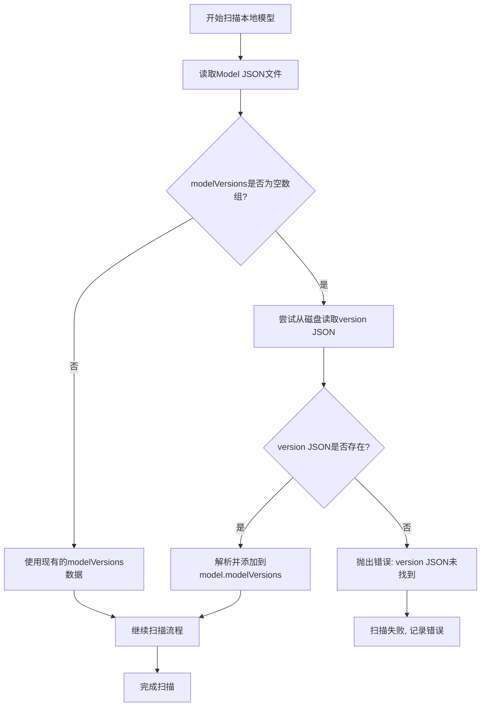

# ModelVersions 空数组问题修复

## 问题描述

在本地模型存储中，Model JSON文件中的`modelVersions`属性是一个空数组。这是出于节省空间和判断实际本地模型中已下载的model version有哪些的考虑。然而，这导致`ModelLayout`类在查找model version时会失败，因为`findModelVersion`方法假设`model.modelVersions`包含所有版本信息。

## 根本原因

`ModelLayout.findModelVersion`方法原本的实现：
```typescript
findModelVersion(modelVersionId: number): ModelVersion {
  const modelVersion = find(
    this.model.modelVersions,
    (mv) => mv.id === modelVersionId,
  );
  if (modelVersion === undefined) {
    throw new Error(`model have no version id: ${modelVersionId}`);
  }
  return modelVersion;
}
```

当`model.modelVersions`为空数组时，这个方法会抛出错误，导致扫描功能无法正常工作。

## 解决方案

修改`findModelVersion`方法，使其能够处理本地存储的情况。当`model.modelVersions`中找不到指定的version时，尝试从本地文件系统读取对应的version JSON文件。

### 修改后的`findModelVersion`方法

```typescript
async findModelVersion(modelVersionId: number): Promise<ModelVersion> {
  const modelVersion = find(
    this.model.modelVersions,
    (mv) => mv.id === modelVersionId,
  );
  
  if (modelVersion === undefined) {
    // 对于本地存储，model JSON中的modelVersions可能是空数组
    // 尝试从本地文件系统读取version JSON
    try {
      const versionJsonPath = getModelVersionApiInfoJsonPath(
        this.basePath,
        this.model.type,
        this.model.id,
        modelVersionId
      );
      
      // 检查文件是否存在
      const fileExists = await Bun.file(versionJsonPath).exists();
      if (!fileExists) {
        throw new Error(`model have no version id: ${modelVersionId} and version JSON not found on disk`);
      }
      
      // 读取并解析version JSON
      const content = await Bun.file(versionJsonPath).json();
      const { modelVersionSchema } = await import("#civitai-api/v1/models");
      const { type } = await import("arktype");
      
      const validation = modelVersionSchema(content);
      if (validation instanceof type.errors) {
        throw new Error(`Invalid version JSON: ${validation.summary}`);
      }
      
      // 添加到model的versions数组中，避免重复读取
      this.model.modelVersions.push(validation);
      return validation;
    } catch (error) {
      throw new Error(`model have no version id: ${modelVersionId} and cannot read from disk: ${error instanceof Error ? error.message : String(error)}`);
    }
  }
  
  return modelVersion;
}
```

## 相关修改

由于`findModelVersion`现在返回`Promise<ModelVersion>`，需要修改所有调用它的地方：

1. **`getModelVersionLayout`方法**：改为异步方法，添加`await`
2. **`checkVersionFilesOnDisk`方法**：添加`await`
3. **`checkVersionFilesAndImagesExistence`方法**：添加`await`
4. **`civitai/index.ts`中的下载功能**：添加`await`
5. **`delete-model-version.ts`中的文件操作**：添加`await`

## 执行流程



## 优势

1. **向后兼容**：不影响现有代码，当modelVersions不为空时使用原有逻辑
2. **自动修复**：当本地有版本JSON但model JSON中没有时，可以自动加载
3. **减少内存占用**：只在需要时加载版本信息
4. **保持数据一致性**：加载的version会添加到model.modelVersions中，避免重复读取

## 测试验证

通过创建测试脚本验证了修复的有效性：
- 当`model.modelVersions`为空数组时，`findModelVersion`会尝试从磁盘读取
- 当磁盘上没有对应的version JSON时，会抛出适当的错误信息
- 所有相关的方法调用都已正确添加`await`

## 影响范围

这个修复影响了以下功能：
1. 本地模型扫描功能
2. 模型版本文件检查
3. 模型版本删除功能
4. Civitai API下载功能

所有相关代码都已更新，确保异步调用的一致性。